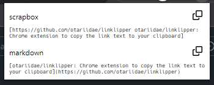

# Linklipper

Chrome extension to copy the link text to your clipboard

## Installation

1. Run `deno task build`
1. Select `dist` directory and
   [load an unpacked extension](https://developer.chrome.com/docs/extensions/mv3/getstarted/development-basics/#load-unpacked)

## Usage

1. Click this extension's icon in the toolbar to open a popup
1. Click the copy icon on the right to copy the Scrapbox or Markdown link text
   of the active tab to your clipboard

## License

MIT License

dist/check.svg and dist/copy.svg are part of
[Octicons](https://github.com/primer/octicons) and licensed under MIT License by
GitHub Inc.
